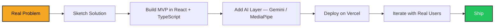

<div align="center">

# Rahul Shyam

**Civil Engineer · Full-Stack Developer · AI Builder**

[](https://rahulshyam-portfolio.vercel.app/)
[](https://linkedin.com/in/rahulshyamcivil)
[](https://x.com/RahulShyamCV)
[](https://threads.com/@rahulcvjps)

*I build software at the intersection of civil engineering and AI. 40+ projects shipped on Vercel.*

</div>

---

## ⚡ What I Build

| Domain | Projects |
|:---|:---|
| 🏗️ **Construction Tech** | AutoBOM — AI BOM generator from drawings |
| 🌐 **Browser Agents** | wayfinder (desktop) · WebNav (Chrome extension) |
| 🎓 **Education / College** | Civilog — OD management for 2000+ students |
| 🧠 **Cognitive / Games** | GREnius — GRE prep + chess engine + mini-games |
| 🤖 **Civil AI** | CivilVision AI — hackathon-winning helpbook |

---

## 🚀 Featured Projects

<div align="center">

| Project | Live | Stack | What It Does |
|:---|:---:|:---|:---|
| **AutoBOM** | [🔗](https://autobomprj.vercel.app/) | React · TypeScript · Gemini Vision | AI BOM from construction drawings |
| **wayfinder** | — | TypeScript · Chromium CDP · MCP | Desktop browser agent with local LLM support |
| **WebNav** | — | Vanilla JavaScript · Manifest V3 | Chrome extension for autonomous browsing |
| **Civilog** | [🔗](https://civilog.vercel.app/) | React · Supabase · RBAC | College-wide OD management platform |
| **GREnius** | [🔗](https://gr-enius.vercel.app/) | React · TypeScript · Chess Engine | GRE preparation + cognitive games |
| **CivilVision AI** | — | React · Gemini API | AI-powered civil engineering helpbook |

</div>

---

## 🧠 Architecture: How I Think



---

## 🛠️ Tech I Actually Use

```text
React        ██████████████████████████████
TypeScript   ██████████████████████████████
Tailwind CSS ██████████████████████████████
Gemini API   ██████████████████████████████
Supabase     ████████████████████████████
Node.js      ██████████████████████████
Three.js     ██████████████████
```

---

## 📍 Experience

| Role | Organization | When |
|:---|:---|:---|
| Site Engineering Intern | Tata Projects — Chennai Underground Metro | 2024 |
| BIM Intern | Pinnacle Future Build, Madurai | Jun–Jul 2026 |

---

## 📫 Reach Me

- **Portfolio:** https://rahulshyam-portfolio.vercel.app/
- **LinkedIn:** https://linkedin.com/in/rahulshyamcivil
- **X:** https://x.com/RahulShyamCV
- **Threads:** https://threads.com/@rahulcvjps

---

<div align="center">

**Chennai, India 🇮🇳**  
**B.E. Civil Engineering @ ESEC**

</div>
````
