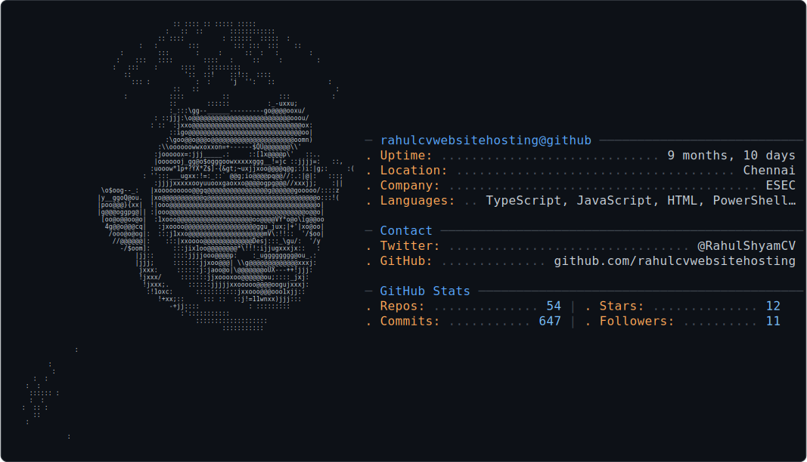

<!--
  ╔══════════════════════════════════════════════════════════════╗
  ║                    RAHULOS v3.7 AI                           ║
  ║                    github.com/rahulcvwebsitehosting            ║
  ╚══════════════════════════════════════════════════════════════╝
-->

<br>

<!-- ═══════════ BOOT ═══════════ -->

```
RahulOS 3.7.0-ai (rahul-cv-01) │ tty1

[    0.000000] Booting system...
[    0.421913] Initializing AI inference subsystem
[    0.422008] Initializing vision processing unit
[    0.422105] Initializing multi-model router
[    0.813042] Mounting root filesystem...

┌──────────────────────────────────────────────────────────┐
│                                                          │
│    ██████╗     █████╗    ██╗  ██╗ ██╗   ██╗ ██╗          │
│    ██╔══██╗   ██╔══██╗   ██║  ██║ ██║   ██║ ██║          │
│    ██████╔╝   ███████║   ███████║ ██║   ██║ ██║          │
│    ██╔══██╗   ██╔══██║   ██╔══██║ ██║   ██║ ██║          │
│    ██║  ██║   ██║  ██║   ██║  ██║ ╚██████╔╝ ███████╗     │
│    ╚═╝  ╚═╝   ╚═╝  ╚═╝   ╚═╝  ╚═╝  ╚═════╝  ╚══════╝     │
│                                                          │
│         ██████╗     ███████╗                             │
│        ██╔═══██╗    ██╔════╝                             │
│        ██║   ██║    ███████╗                             │
│        ██║   ██║    ╚════██║                             │
│        ╚██████╔╝    ███████║                             │
│         ╚═════╝     ╚══════╝                             │
│                                                          │
└──────────────────────────────────────────────────────────┘

[    1.315290] PCI: Using ACPI for IRQ routing
[    1.841006] Initramfs unpacking: Initializing userland...
[    2.101483] Freeing initrd memory: 32768K

─── SERVICE MANAGER INIT ────────────────────────────────

[  OK  ] Started gemini-adapter.service       — Multi-model routing
[  OK  ] Started vision-pipeline.service       — Computer Vision
[  OK  ] Started ml-inference.service          — AI Inference Engine
[  OK  ] Started ollama-bridge.service         — Local LLM runtime
[  OK  ] Started api-gateway.socket            — Next.js API routes
[  OK  ] Started firebase-connector.service    — Firebase backend
[  OK  ] Started cloud-run-agent.service       — Cloud Run
[  OK  ] Started vercel-edge-agent.service     — Edge delivery
[  OK  ] Reached target session.target

```

<p align="center">
  
</p>

<br>

<!-- ═══════════ LOGIN ═══════════ -->

```
rahul@rahulos login: rahul
Password: ********

┌──────────────────────────────────────────────────────────┐
│                                                          │
│   User: rahul                                            │
│   UID: 1000    GID: 1000                                │
│   Home: /home/rahul                                      │
│   Host: Windows 11 + WSL2                                │
│   Shell: /bin/zsh                                        │
│   Editor: VS Code                                        │
│                                                          │
└──────────────────────────────────────────────────────────┘

Login successful.

```

<br>

<!-- ═══════════ BASIC COMMANDS ═══════════ -->

```
rahul@rahulos:~$ whoami
rahul

rahul@rahulos:~$ pwd
/home/rahul

rahul@rahulos:~$ uptime
 00:42:21 up 12 min,  1 user,  load average: 0.08, 0.12, 0.15

rahul@rahulos:~$ hostnamectl
   Static hostname: rahul-cv-01
  Operating System: RahulOS 3.7.0-ai
           Kernel: Linux 5.15.153.1-microsoft-standard-wsl2
     Architecture: x86-64

```

<br>

<!-- ═══════════ SYSTEM INFORMATION ═══════════ -->

```
rahul@rahulos:~$ fastfetch

rahul@rahulos
--------------
OS: RahulOS 3.7.0-ai
Shell: zsh 5.9
Editor: VS Code
Languages: TypeScript, Python, JavaScript, C++
Stack: React · Next.js · Gemini · Firebase · Cloud Run · Vercel
Location: Chennai, India
Portfolio: rahulshyam-portfolio.vercel.app
GitHub: github.com/rahulcvwebsitehosting

```

<br>

<!-- ═══════════ FILE SYSTEM ═══════════ -->

```
╭───────────────────────── Terminal ─────────────────────────────╮
│                                                                  │
│   [ ~ ]  [ projects/ ]  [ services/ ]  [ .config/ ]             │
│                                                                  │
│   rahul@rahulos:~$ _                                             │
│                                                                  │
╰──────────────────────────────────────────────────────────────────╯

```

<br>

```
rahul@rahulos:~$ ls -la

total 64
drwxr-xr-x  9 rahul rahul  4096 Jul  9 00:42 .
drwxr-xr-x  3 root  root    4096 Jul  1 00:00 ..
drwxr-xr-x  7 rahul rahul  4096 Jul  9 00:42 projects/
drwxr-xr-x  2 rahul rahul  4096 Jul  9 00:42 experience/
drwxr-xr-x  2 rahul rahul  4096 Jul  9 00:42 roadmap/
-rw-r--r--  1 rahul rahul   512 Jul  9 00:42 about.txt
-rw-r--r--  1 rahul rahul  1024 Jul  9 00:42 now.txt
drwx------  2 rahul rahul  4096 Jul  9 00:42 .config/

```

<br>

<!-- ═══════════ PROJECTS ═══════════ -->

```
rahul@rahulos:~$ tree projects/

projects/
├── FabricScan-AI/
│   ├── vision/
│   ├── api/
│   ├── frontend/
│   └── deploy/
├── CivilVisAi/
│   ├── app/
│   ├── model/
│   └── research/
├── AutoBOM/
│   ├── parser/
│   ├── api/
│   └── deploy/
├── StudySense/
│   ├── web/
│   ├── api/
│   └── infra/
├── Civilog/
│   ├── admin/
│   ├── qr-scanner/
│   └── api/
├── FallGuard/
│   ├── detection/
│   └── hardware/
├── Sehatam/
│   ├── symptom-checker/
│   ├── api/
│   └── deploy/
└── Hostel-Planner/
    ├── backend/
    └── schema/

```

<br>

<!-- ═══════════ AI STATUS ═══════════ -->

```
rahul@rahulos:~$ rahul-ai status

┌──────────────────────────────────────────────────────────┐
│                                                          │
│  Router        ONLINE     Gemini 2.5 Pro                 │
│  Vision        READY      Inspection pipeline            │
│  Embeddings    ACTIVE     Dense vector store             │
│  Deployments   HEALTHY    Vercel · Cloud Run · Firebase  │
│                                                          │
│  Fallback:   Claude (on route failure)                   │
│                                                          │
└──────────────────────────────────────────────────────────┘

```

<br>

<!-- ═══════════ CURRENTLY BUILDING ═══════════ -->

```
rahul@rahulos:~$ now

FabricScan AI
  Gemini Vision — garment defect detection + BOM

FallGuard
  Motion detection model — CV + sensor fusion

AutoBOM
  OCR parsing improvements — construction drawings

Sehatam
  AI symptom checker — rural healthcare (Google SGC 2026)

```

<br>

<!-- ═══════════ SKILLS ═══════════ -->

```
rahul@rahulos:~$ skills

Languages
  TypeScript · Python · JavaScript · C++

Frameworks
  Next.js · React · Node.js · Tailwind CSS

AI / ML
  Gemini SDK · InsightFace · OpenCV · Embeddings

Infrastructure
  Firebase · Cloud Run · Vercel · Supabase

```

<br>

<!-- ═══════════ GITHUB ═══════════ -->

```
rahul@rahulos:~$ gh repo list --limit 5

rahulcvwebsitehosting/rahulcvwebsitehosting  RahulOS profile README

rahul@rahulos:~$ git log --oneline -3
• d1e2f3a Add Gemini Vision defect detection to FabricScan AI
• c4e5d6f Update Gemini API handler in CivilVision AI
• a7b8c9d Integrate Firebase auth in StudySense

```

<br>

<!-- ═══════════ MANUAL ═══════════ -->

```
rahul@rahulos:~$ man rahul

NAME
     rahul — full-stack developer and AI engineer

SYNOPSIS
     rahul [--build project] [--deploy target]

DESCRIPTION
     Builds software from prototype to production.
     Focuses on computer vision, multimodal systems,
     full-stack web development, and AI applications
     for civil engineering.

     Has hands-on site experience — tunnel and guide-
     wall construction at Chennai Underground Metro
     (Tata Projects), and BIM/Revit at Pinnacle Future
     Build. Codes with the same intensity he brought
     to construction sites.

OPTIONS
     --build project    Build from concept to deployment.
     --deploy target    Ship to Vercel, Cloud Run, or Firebase.

EXAMPLES
     rahul --build fabricscan-ai    Gemini Vision defect detection + BOM
     rahul --deploy cloud-run       Backend to Cloud Run

FILES
     ~/projects/         Source code for all projects
     ~/experience/       Work history
     ~/roadmap/          Version tracker

AUTHOR
     Rahul Shyam · Chennai, India
     B.E. Civil Engineering, ESEC

SEE ALSO
     github.com/rahulcvwebsitehosting

```

<br>

<!-- ═══════════ SURPRISE ═══════════ -->

```
rahul@rahulos:~$ fortune

"The best code is the code you never had to write."

rahul@rahulos:~$ sudo make coffee
[sudo] password for rahul:
Permission denied.
System requires manual intervention. Please proceed to nearest caf\u00e9.

```

<br>

<!-- ═══════════ ROADMAP + CONTACT ═══════════ -->

```
rahul@rahulos:~$ cat roadmap/tracker.txt

Stable   v3.7.0    FabricScan AI · CivilVision AI · AutoBOM
Next     v3.8.0    FallGuard · Hostel Planner
Research v4.0.0    TunnelViz · OSB ETA

rahul@rahulos:~$ cat .config/contact

Portfolio  rahulshyam-portfolio.vercel.app
GitHub     github.com/rahulcvwebsitehosting
LinkedIn   linkedin.com/in/rahulshyamcivil
           threads.net/@rahulcvjps

Chennai, India · B.E. Civil Engineering, ESEC

```

<br>

<!-- ═══════════ SHUTDOWN ═══════════ -->

```
rahul@rahulos:~$ exit
logout

Saving session...
[  OK  ] Shell history written
[  OK  ] AI services stopped
[  OK  ] Filesystems unmounted

System halted.
```

<br>
<br>

<!--
  RahulOS v3.7 — github.com/rahulcvwebsitehosting
-->